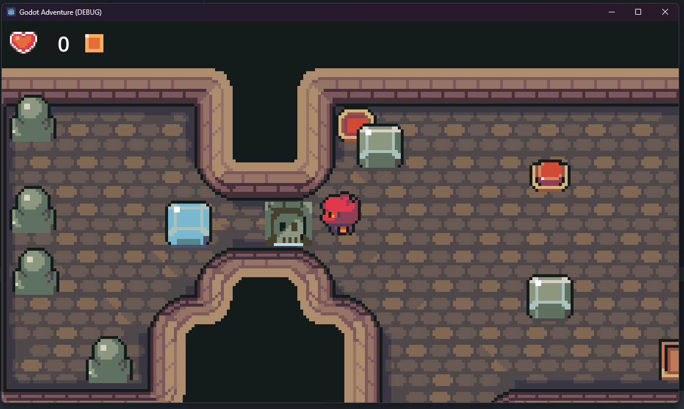

# GoDot Adventure

Original course: [GameDev Course](https://www.gamedev.tv/courses/godot-2d-action-adventure)

Made with [GoDot Engine v4.3](https://godotengine.org/)

[Asset folder used](./Ninja%20Adventure%20-%20Asset%20Pack/) is a property of the GameDev Course (tilesets, assets, sounds, musics, GUI elements, etc.). They are responsible for the Asset pack.

## How to run

1. Download GoDot (4.3 is better as it is the version used).
2. Open the Project with GoDot
3. Run the Game !

## Screenshots

